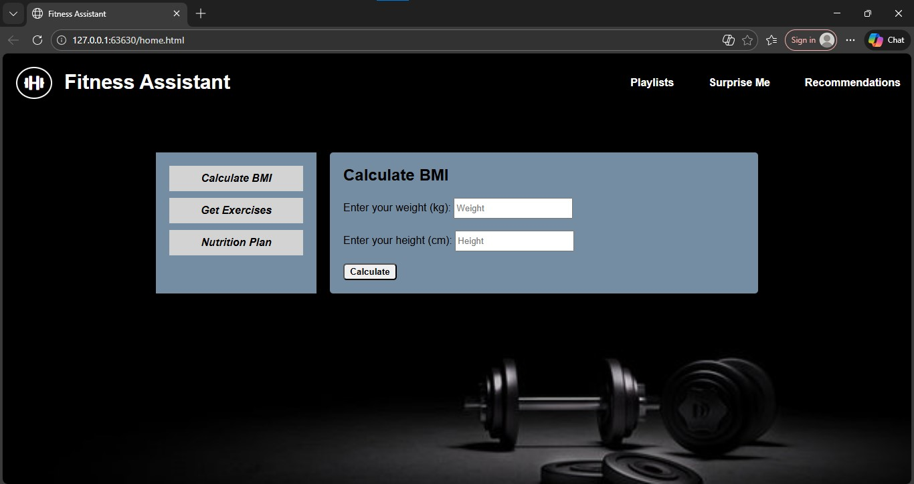
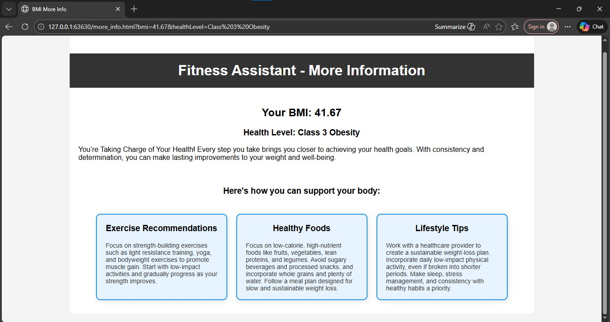

# FITAI 2.0 🏋️‍♀️🤖

FITAI 2.0 is a fitness and wellness web application designed to help users
understand basic health metrics and explore exercise and nutrition
guidance based on their personal choices.

The application focuses on awareness, flexibility, and healthy lifestyle
habits rather than strict medical recommendations.

---

## 🔥 Key Features

### 🧮 BMI Calculator
- Calculates Body Mass Index (BMI) using user input
- Displays general health category (underweight, normal, overweight)
- Provides basic awareness tips
- Used only for informational purposes

---

### 🏃 Exercise Guidance
- Users select their preferred fitness level:
  - **Beginner**
  - **Intermediate**
  - **Professional**
- Exercises are displayed based on the selected level
- Users can:
  - View additional exercises
  - Access more information about specific workouts
- Includes general lifestyle and exercise safety tips

---

### 🥗 Nutrition Plans
- Users select a nutrition goal:
  - **Weight Loss**
  - **Weight Gain**
  - **Keto Diet**
- Each plan provides:
  - Suggested food options
  - Lifestyle recommendations
  - A simple and easy-to-follow daily plan

---

## 🛠️ Tech Stack
- HTML
- CSS
- JavaScript
- JSON

---

## 📁 Project Structure
- `data/` – Images and videos
- `*.html` – Application pages
- `*.css` – Styling
- `*.js` – Application logic
- `*.json` – Nutrition and exercise data

## 📸 Screenshots

### Home Page

### BMI Calculator Resulting Info

### Exercise Selction Resulting Info

---

## 🚀 How to Run
1. Clone the repository
2. Open `home.html` in a browser
3. Explore BMI, exercise, and nutrition sections independently

---

## 🎯 Project Objective
To promote health awareness and encourage users to make informed fitness
and nutrition choices through a simple and interactive web application.

---

⚠️ Disclaimer: This application is for educational purposes only and does not replace professional medical advice.
